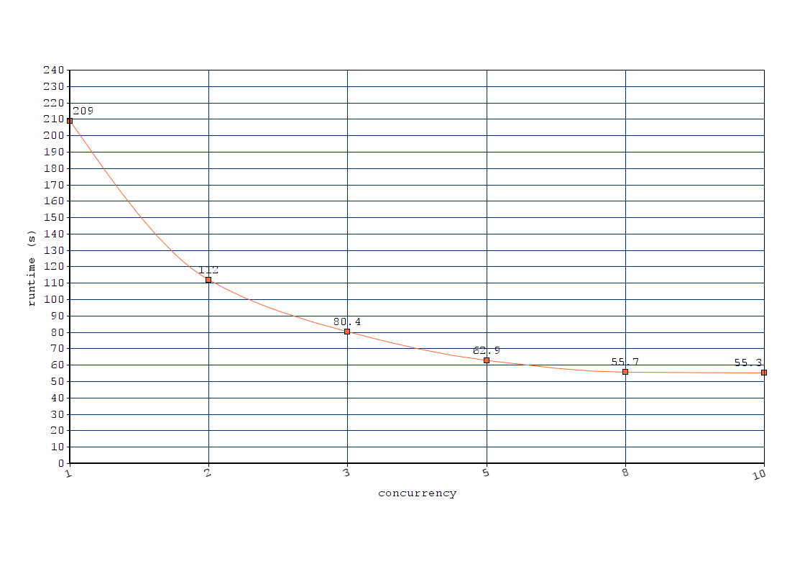

# Simple python client for GROBID REST services

This Python client can be used to process in an efficient concurrent manner a set of PDF in a given directory by the [GROBID](https://github.com/kermitt2/grobid) service. Results are written in a given output directory and include the resulting XML TEI representation of the PDF. 

## Build and run

You need first to install and start the *grobid* service, latest stable version, see the [documentation](http://grobid.readthedocs.io/). It is assumed that the server will run on the address `http://localhost:8070`. You can change the server address by editing the file `config.json`.

## Requirements

This client has been developed and tested with Python 3.5.

## Install

Get the github repo:

> git clone https://github.com/kermitt2/grobid-client-python

> cd grobid-client-python

There is nothing more to do to start using the python command lines, see the next section. 

## Usage and options

```
usage: grobid-client.py [-h] [--input INPUT] [--output OUTPUT]
                        [--config CONFIG] [--n N] [--generateIDs]
                        [--consolidate_header] [--consolidate_citations]
                        [--force]
                        service

Client for GROBID services

positional arguments:
  service               one of [processFulltextDocument,
                        processHeaderDocument, processReferences]

optional arguments:
  -h, --help            show this help message and exit
  --input INPUT         path to the directory containing PDF or text to process
  --output OUTPUT       path to the directory where to put the results (optional)
  --config CONFIG       path to the config file, default is ./config.json
  --n N                 concurrency for service usage
  --generateIDs         generate random xml:id to textual XML elements of the
                        result files
  --consolidate_header  call GROBID with consolidation of the metadata
                        extracted from the header
  --consolidate_citations
                        call GROBID with consolidation of the extracted
                        bibliographical references
  --include_raw_citations
                        call GROBID requesting the extraction of raw citations 
  --include_raw_affiliations
                        call GROBID requestiong the extraciton of raw affiliations
  --force               force re-processing pdf input files when tei output
                        files already exist
```

Examples:

> python3 grobid-client.py --input ~/tmp/in2 --output ~/tmp/out processFulltextDocument

This command will process all the PDF files present under the input directory recursively (files with extension `.pdf` only) with the `processFulltextDocument` service of GROBID, and write the resulting XML TEI files under the output directory, reusing the file name with a different file extension (`.tei.xml`), using the default `10` concurrent workers. 

If `--output` is omitted, the resulting XML TEI documents will be produced alongside the PDF in the `--input` directory.

> python3 grobid-client.py --input ~/tmp/in2 --output ~/tmp/out --n 20 processHeaderDocument

This command will process all the PDF files present in the input directory (files with extension `.pdf` only) with the `processHeaderDocument` service of GROBID, and write the resulting XML TEI files under the output directory, reusing the file name with a different file extension (`.tei.xml`), using `20` concurrent workers. 

By default if an existing `.tei.xml` file is present in the output directory corresponding to a PDF in the input directory, this PDF will be skipped to avoid reprocessing several times the same PDF. To force the processing of PDF and over-write of existing TEI files, use the parameter `--force`.   

The file `test.py` gives an example of usage from a another python script. 

## Benchmarking

Full text processing of __136 PDF__ (total 3443 pages, in average 25 pages per PDF) on Intel Core i7-4790K CPU 4.00GHz, 4 cores (8 threads), 16GB memory, `n` being the concurrency parameter:

| n  | runtime (s)| s/PDF | PDF/s |
|----|------------|-------|-------|
| 1  | 209.0 | 1.54       | 0.65 |
| 2  | 112.0 | 0.82       | 1.21 |
| 3  | 80.4  | 0.59       | 1.69 |
| 5  | 62.9  | 0.46       | 2.16 |
| 8  | 55.7  | 0.41       | 2.44 |
| 10 | 55.3  | 0.40       | 2.45 |



As complementary info, GROBID processing of header of the 136 PDF and with `n=10` takes 3.74 s (15 times faster than the complete full text processing because only the two first pages of the PDF are considered), 36 PDF/s. In similar conditions, extraction and structuring of bibliographical references takes 26.9 s (5.1 PDF/s).

## Todo

Benchmarking with many more files (e.g. million ISTEX PDF). Also implement existing GROBID services for text input (date, name, affiliation/address, raw bibliographical references, etc.). Better support for parameters (including elements where to put coordinates).

## License and contact

Distributed under [Apache 2.0 license](http://www.apache.org/licenses/LICENSE-2.0). 

Main author and contact: Patrice Lopez (<patrice.lopez@science-miner.com>)
