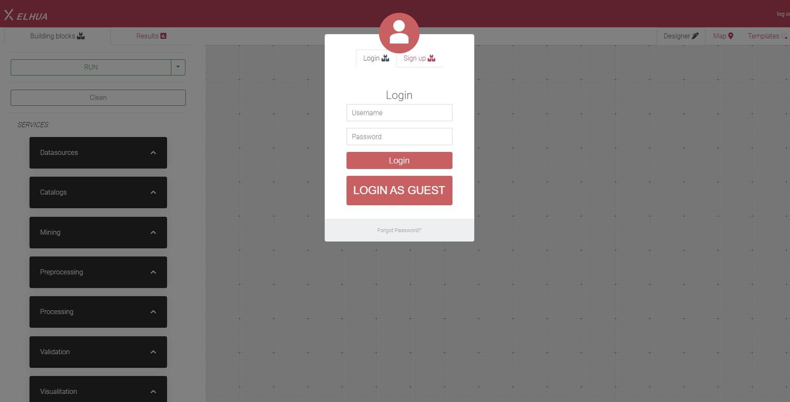
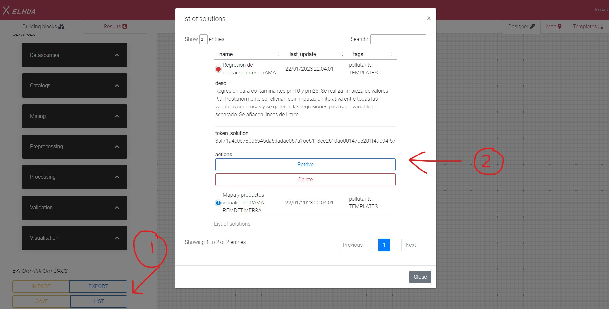
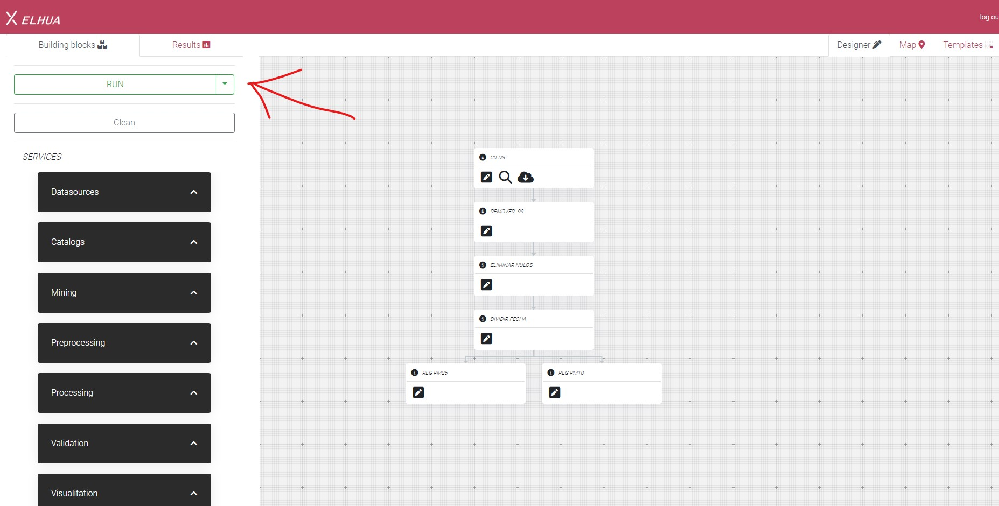
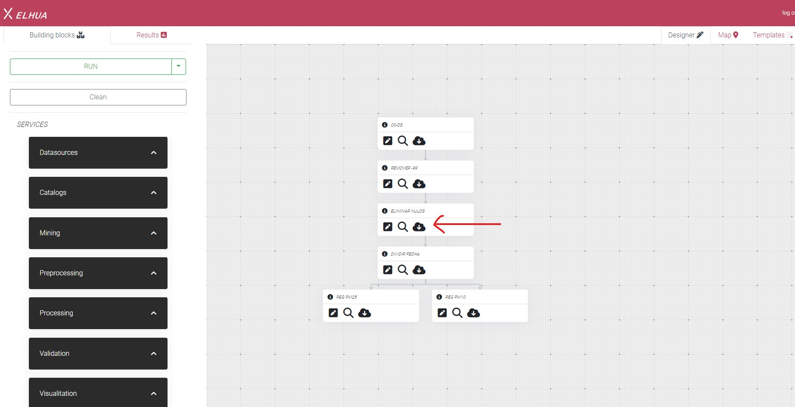

# _Xel: an orchestation model for reliable and generic services_

Xelhua (_Xel_) is a cloud-agnostic big data platform that faces the challenges of enabling end-users and organizations (at high-level and by using graphical design-driven schemes) to build high availability cloud agnostic analytics services without programming or configuring cloud computing and storage services. 

- Create your own service repository.
- Deploy your service repository in any kind of infrastructure, from local machines to cloud or multi-cloud.
- Use the deployed services to build dynamic solutions.
- Execute the solution and enjoy the ✨Magic✨.

# Features

- Convert your applications with a black box model into services.
- Deploy your services on any infrastructure, whether locally, in a cluster, or the cloud.
- Create replicas of your services to add reliability.
- Create dynamic solutions using the services in the mesh.

# Muyal project

Xelhua is part of Muyal, the pronaces project _"Plataforma tecnológica para la gestión, aseguramiento, intercambio y preservación de grandes volúmenes de datos en salud y construcción de un repositorio nacional de servicios de análisis de datos de salud"_ and fulfills with the following products:

+ Modules to carry out basic statistical processes, statistical grouping, spatio-temporal queries with conditional operators and execution of evolutionary computation algorithms.

+ An encapsulation scheme and adaptation of analysis algorithms, mining and evolutionary computation to the structures
of crypto-applications

# Tech

The Xel platform uses a number of open source projects in currently implemented services, some of them are:

- [Tensorflow](https://www.tensorflow.org/)- open source library for numerical computation and large-scale machine learning.
- [scikit-learn](https://scikit-learn.org/stable/) Machine Learning in Python.
- [GROBID](https://grobid.readthedocs.io/en/latest/) Machine learning library. 
- [GloVe](https://nlp.stanford.edu/projects/glove/) Unsupervised learning algorithm for obtaining vector representations for words.
- [Docker](https://www.docker.com/) A containers plataform.


# Installation

Xel requires [Docker platform](https://www.docker.com/) and the [Docker-compose](https://docs.docker.com/compose/) to run.

The installation and deployment of this platform is done using virtual containers using the [Docker platform](https://www.docker.com/), and the [Docker-compose](https://docs.docker.com/compose/) tool for the deployment. If you want to deploy in a distributed environment, you need to configure a [Docker-swarm](https://docs.docker.com/engine/swarm/) cluster instead.

_Note: To install xelhua on Windows, it is recommended to use docker in conjunction with [WSL2](https://www.ionos.mx/digitalguide/servidores/know-how/wsl2/) and install an operating system like Ubuntu or Centos._

  ## 1.- Container images
  The Xelhua modules can be generated in 2 ways: By using the source code to build the images from scratch, or by using the published images.

  ### A) To build the images, use the following command:
  
  ```sh
  ./build.sh
  ```

  ### B) To download the images from the public repository, use the following command:
  ```sh
  ./pull.sh
  ```
  ## 2.- Configuration

By default, you don't need to configure Xel to start using it, however, if you need to change any behavior of the platform, you need to review the documentation.

  ## 3.- Deployment

  ```sh
  docker-compose up -f Xel.yml -d
  ```
  or to see the lofs...
  ```sh
  docker-compose up -f Xel.yml
  ```

Xelhua can also be deployed in a distributed environment by using [Docker-swarm](https://docs.docker.com/engine/swarm/swarm-tutorial/), for this the following command is used.

```sh
 docker stack deploy -c Xel_remote.yml Xel
```

  ## Build and updates

  The Xelhua's modules are self-contained in virtual containers. In case of updating the source code, it is necessary to build the images locally using the _build.sh_ script.


To rebuild the images in case of any change...
```sh
./build.sh
```
# Important files
 + [_AG/_](./AG). Contains the API Gateway scripts.
 + [_BuildingBlocks/_](./BuildingBlocks). Folder with all the building blocks, the modules that abstract the applications and provide them with communication interfaces and data managers.
 + [_localdata/_](./localdata). Default folder where application results and user datasets are stored.
 + [_NonFunctional/_](./NonFunctional). Folder with non-functional requirements scripts.


# Running and designing solutions

## Design
Once a mesh of deployed services exists, they can be used to create solutions (localhost:25000/executeDAG).
The solutions are designed based on instructions defined as a tree, following the following structure:
```json
{
    "DAG": "[
      {id:c1-data_clean,
      service:cleanning,
      childrens:
      [
        {
          id:c2-s-imputation,
          service:imputation,
          childrens:
            [
              {
                id:c3-s-split-and-join,
                service:join_split,
                childrens:
                  [
                    {
                      id:c4-regression_serv,
                      service:regression,
                      childrens:[],
                      actions:[LINEARS],
                      params:{LINEARS:{actions:[LINEARS],
                        var_x:year,
                        list_var_x:0,
                        var_y:[PM10],
                        filter_column:,
                        filter_value:,
                        alpha:0.05,
                        SAVE_DATA:true}}
                    },
                    {
                      id:c5-regression_serv,
                      service:regression,
                      childrens:[],
                      actions:[LINEARS],
                      params:{LINEARS:{actions:[LINEARS],
                        var_x:year,
                        list_var_x:0,
                        var_y:[PM10],
                        filter_column:,
                        filter_value:,
                        alpha:0.05,
                        SAVE_DATA:true}}
                    }
                  ],
                  actions:[SCOLUMN],
                  params:{SCOLUMN:{actions:[SCOLUMN],
                    column:FECHA,
                    method:DT,
                    date_format:%m/%d/%Y,
                    split_value:/,
                    columns:,
                    separator:,column_name:,
                    SAVE_DATA:true}}
              }
            ],
            actions:[DROP],
            params:{DROP:{columns:[CO,NO,NO2,NOX,O3,PM10,PM25,PMCO,SO2],
              actions:[DROP],
              imputation_type:,
              strategy:,
              groupby:0,n_neighbors:2,
              fill_value:,
              method:any,n_na:0,
              to_drop:0,
              SAVE_DATA:true}}
        }
      ],
      actions:[CLEAN],
      params:{CLEAN:{actions:[CLEAN],columns:[CO,NO,NO2,NOX,O3,PM10,PM25,PMCO,SO2],
        outliers_detection:ZS,
        method:,
        encoding_method:,
        n_standard_desviations:2,
        min_range:1,
        max_range:1,
        norm_method:,
        list_values:-99,
        replace_with:,
        label_column:,
        list_labels:,
        SAVE_DATA:true}}
      }
      ]",
    "data_map": {
        "data": {
            "catalog": "Examples",
            "filename": "contaminantes_1986-2022.csv",
            "token_user": "300d03efcac4bab98d04af639dba337d5350ebd955fa39b4912376f7715a9fc6"
        },
        "type": "LAKE"
    },
    "auth": {
        "user": "300d03efcac4bab98d04af639dba337d5350ebd955fa39b4912376f7715a9fc6",
        "workspace": "Default"
    },
    "alias": "Regresion de contaminantes - RAMA",
    "token_solution": "3bf71a4c0e78bd6545da6dadac067a16c6113ec2610a600147c5201f49094f57"
}
```
- _DAG_ contains the graph with the configuration and parameters of the services that will process a data source. The graph must be in String format.
  the graph must contain the following parameters:
  + **service** is the name of the service called.
  + **actions** is a set with the names of the application inside the bulding block called with **service**. 
  + **params** is a set of params defined in a key-valye format that will be used for the app to preform the data transformation.
  + **childrens** is a set of childres with the instructions to be executed for services after finish _this_ parent. 

- _data_map_ contains an object with the information of the dataset to process. Following this example, the dataset _pollutants_1986-2022.csv_ belongs to the user 300d03efcac4bab98d04af639dba337d5350ebd955fa39b4912376f7715a9fc6 in the Examples folder

  The dataset must be previously uploaded to the platform. Below are the available ways up to this version of xel to provide a dataset

  + **Upload it as a file**. Dataset can be send to the mesh as _multipart/form-data_ to the path /UploadDataset. In addition to the file, information must be provided for storage in the lake, such as the user identifier and the catalog (or workspace) where it will be stored, this is done as follows:

    ```json
      {"workspace": "<catalog>", "user": "<token_user>"}
    ```

    Once the file has been uploaded it needs to be specified in the json with the instructions. In this case, the dataset will be in the data lake of xel, and it is specified as follows:

    ```json
      {"data_map":{"data":{"token_user":"<token_user>","catalog":"<catalog>","filename":"<name of the dataset>"},"type":"LAKE"}}
    ```

  + Using the Acquisition _BB_ to access remote or local datasets (in localdata folder). In this case, since an acquisition BB will be used to obtain the data, xel is not required to provide input data. This is specified in the statement json as follows:
    ```json
      {"data_map":{"data":,"type":"DUMMY"}}
    ```

- _auth_ contains the user's token and the workspace in which it is working. This information is used to assign permissions to the graph that will be executed.

- _alias_ is the name that will be assigned to the graph.
- _token_solution_: is the unique identifier of the graph. If none is sent, one will be assigned automatically. If an ID that already exists is assigned, it will be overwritten, or the existing information will be used to compare the status of the services and the existing results.

_Note: The use of xelhua endpoints requires, in addition to the parameters of the endpoint itself, an access token sent through the 'x-access-token' header_ 

# Execution

To execute the solutions can be done in 2 ways:
+ Using the GUI deployed in http://localhost:8080.
+ Using the Client.py app.  Execute this client with the following command:

    ```sh
    $ python3 Client.py localhost:25000 ./Examples/Solutions/map_reduce.json ./localdata/EC_mun.csv 
    ```
    where:
    + localhost:25000 is the host ip with the AG.
    + ./Examples/Solutions/map_reduce.json  is the path for the json file with the instructions.
    + ./localdata/EC_mun.csv is the path with the file of dataset (this is optional depending of the instructions).
    
    
# Example

1.  Open the path http://localhost:8080/ in your browser.
2.  Select the "Login as guest" button. 
3.  Go to the "list" button located in the lower left corner. Then select the first record of the table and press the "Retrive" button to load the example graph 
4. A previously configured graph will be shown as an example. To run it, press the green "Run" button located in the upper left corner. 
5. At the end of the execution, icons will appear for downloading the results of each of the BBs in the graph. It is possible to change the parameters of each box, add more boxes, or change the dataset to customize the solution according to the user's needs.  

# Published works

+  _Barron-Lugo, J.A. et al. (on review) “Xel: A cloud-agnostic data platform for the design-driven building of high-availability data science services.”_

+ [_Garcia, J. C. M., Lugo, J. A. B., Compean, J. L. G., Arevalo, I. L., Carretero, J., & Oropeza, M. C. (2023). Data and Task Orchestration Defined by Spatio-Temporal Variables for Healthcare Data Science Services. Proceedings of the 9th International Conference on Bioinformatics Research and Applications, 95–101. Presented at the Berlin, Germany. doi:10.1145/3569192.3569208_](https://dl.acm.org/doi/10.1145/3569192.3569208)

+ _Barron-Lugo, J.A. et al. (2022) “Xelhua: una plataforma para la creacion de sistemas de ciencia de datos bajo demanda,” in "Bigdata en Salud: Tecnologías Emergentes y Aplicaciones. 1st edn. Santiago Puebla, Puebla: Montiel &amp; Soriano Editores S.A. de C.V., pp. 81–95._

+ [Barron-Lugo, J.A., Gonzalez-Compean, J. L., Carretero, J., Lopez-Arevalo, I., & Montella, R. (2021). A novel transversal processing model to build environmental big data services in the cloud. Environmental Modelling & Software, 144, 105173.](https://www.sciencedirect.com/science/article/abs/pii/S1364815221002152?via%3Dihub)

# Credits
* Author: Juan Armando Barrón Lugo ([J.Armando Barrón-Lugo](https://orcid.org/my-orcid?orcid=0000-0002-9619-8116))
* Email: juan.barron@cinvestav.mx, juanbarronlugo@gmail.com
* GitHub: [@ArmandoBarron](https://github.com/ArmandoBarron)
* LinkedIn: [@Armando Barrón](https://www.linkedin.com/in/armando-barr%C3%B3n-52298310b) 


This work has been partially supported by the project 41756 ``Plataforma tecnológica para la gestión, aseguramiento, intercambio y preservación de grandes volúmenes de datos en salud y construcción de un repositorio nacional de servicios de análisis de datos de salud'' by the  FORDECYT-PRONACES.


# License

[](https://opensource.org/licenses/Apache-2.0)


Licensed under the Apache License, Version 2.0 (the "License"); you may not use this file except in compliance with the License. You may obtain a copy of the License at

http://www.apache.org/licenses/LICENSE-2.0
